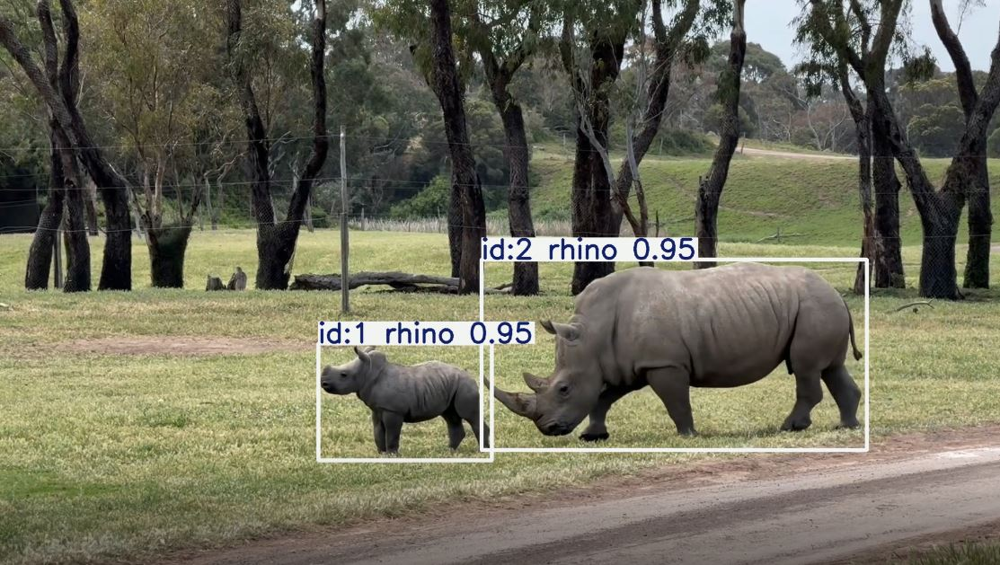
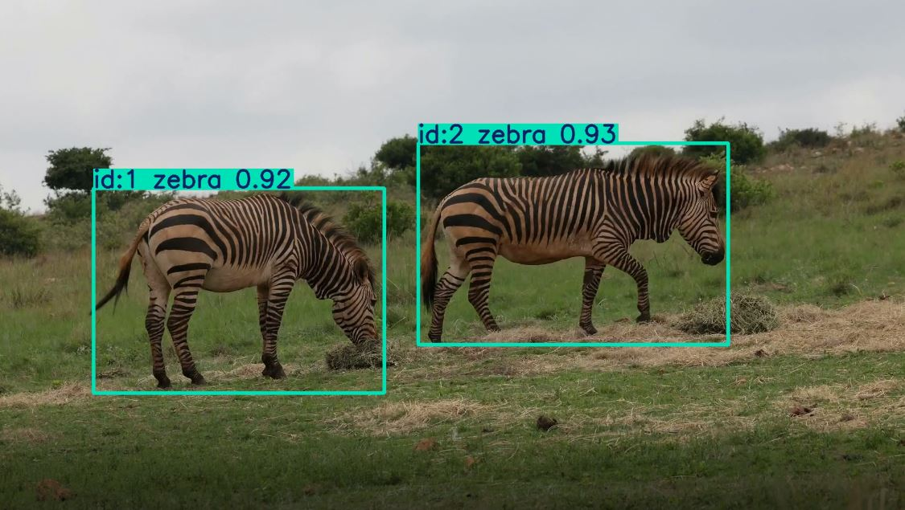

# AI-Powered Animal Welfare Monitoring System 2026

## Overview
This project uses **YOLOv8** for animal detection and tracking to monitor wildlife activity. Videos of animals (rhinos, elephants, zebras, etc.) are analyzed frame by frame to detect behavior, movement, and welfare alerts.

The output is visualized in a **Power BI dashboard**, providing insights like:
- Behavior classification: resting, walking, running
- Welfare alerts: low activity vs normal
- Average movement per frame
- Total distance traveled per animal

---

## Features
- **Object Detection & Tracking:** YOLOv8 trained on a custom wildlife dataset.
- **Behavior Analysis:** Movement calculated using bounding box positions, classified automatically.
- **Welfare Monitoring:** Alerts for low activity animals.
- **Dashboard Visualization:** Power BI dashboard with slicers for animal selection, behavior trends, and activity charts.

---

## Notebook
The Colab notebook `animal_welfare_colab.ipynb` contains:
1. Mounting Google Drive
2. Loading YOLOv8 pretrained model
3. Training on custom dataset
4. Running detection on images and videos
5. Tracking animals and exporting data to CSV
6. Calculating behavior and welfare metrics

> **Note:** Data preprocessing, sorting, and aggregation were furthur performed in Power BI for dashboard visualization and insights.

---

## Project Examples / Visuals

### Detection Example 1


### Detection Example 2


### Dashboard Example 1


### Dashboard Example 2


---

## Getting Started

### Requirements
- Python 3.12+
- Google Colab (optional, for easy GPU/TPU access)
- Libraries:
  ```bash
  pip install ultralytics pandas numpy
